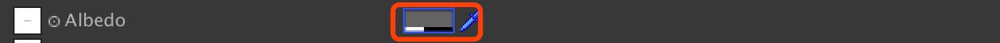
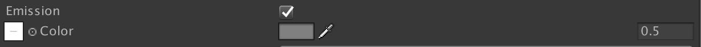
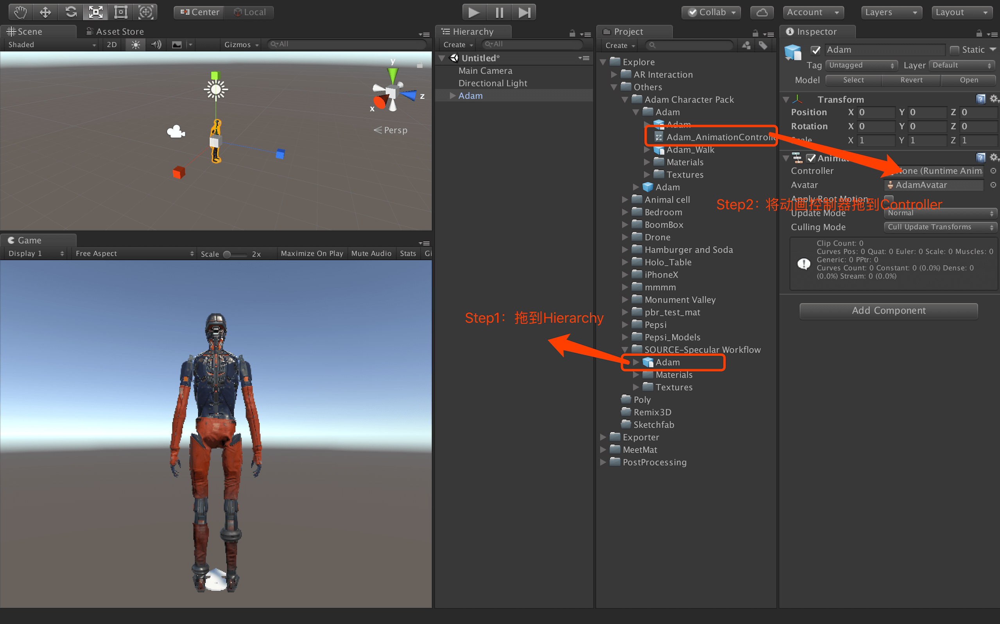

# glTF-Export-Tutorial
# 一.什么是glTF？
* glTF是一种3D内容的格式标准；
* glTF的设计是面向实时渲染应用的，尽量提供可以直接传输给图形API的数据形式，不再需要二次转换；
* 通俗来讲，我们可以理解他为3D领域的JPEG；
* glTF使用一组通用的参数来定义基于物理渲染（PBR）的材质；
* glTF defines materials using a common set of parameters that are based on widely used material representations from Physically-Based Rendering (PBR)
更多关于glTF的介绍还可以查看https://www.khronos.org/gltf/

# 二.RAVVAR WebAR/3D 渲染器对glTF的支持性如何？
## 2.1材质
* 支持PBR材质（Metallic-Roughness Material 和Specular-Glossiness Material）；
* 这两种材质分别对应了PBR材质的两种工作流，即金属/粗糙度工作流和镜面/光泽度工作流；
* 如果您对PBR材质不够熟悉，你可以参考：https://www.allegorithmic.com/pbr-guide
* 支持开启是否双面显示；

## 2.2贴图
为了保证网络传输时节省带宽，仅支持不透明的JPG格式和透明的PNG格式；

## 2.3动画
* Skeleton & Bones
> Rig your model with a skeleton and animate the bones. Great for full body animation.  
* Solid
> Animate translation, rotation and scale of your meshes. Ideal for mechanical models.  
* Morph Targets
> Morph shapes from one state to another. Great for posing faces.  

# 三.如何导出满足RAVVAR WebAR/3D编辑器要求的glTF文件？
## 3.1制作符合规范的模型动画
具体规范请参考：https://github.com/yangfawen/RAVVAR-3D-Model-Specification

## 3.2导出glTF的流程图示

- - - -
方案1：需要艺术家在各类3D建模软件中安装glTF导出插件，然后配置模型材质和其它设置后导出；由于使用的3D建模软件种类繁多，目前支持度良好的3D软件有：3ds max、Maya、Blender、Substance Painter
方案2：需要艺术家在游戏引擎Unity中安装glTF导出插件，然后配置模型材质和其它设置后导出；这些适用于更加广泛的建模软件，比如：Cinema 4D、Sketchup、Zbrush、Inventor、Revit、Lightwave、SolidWorks等

通过方案2，我们也可以延伸出更多的形式，可以这样认为，只要是能够导入到Unity的模型，最终我们都能通过Unity的glTF导出插件转化为glTF。这样说来一些小众的3D设计软件、一些3D扫描软件以及一些倾斜摄影软件都能制作并导出中间3D格式，然后再导入Unity中，最终导出glTF。

这里向大家推荐两款小众的3D设计软件：
> 微软3D画图软件：画图3D（Paint 3D）  
> [购买 画图 3D - Microsoft Store zh-CN](https://www.microsoft.com/zh-cn/store/p/paint-3d-preview/9nblggh5fv99)  

> 像素化风格3D设计软件  
> http://ephtracy.github.io/  

## 3.3使用Unity导出glTF
### 3.3.1Unity的基础了解
Unity支持丰富的材质类型（通过设置不同的Shader来实现），目前导出glTF只支持两种材质（两种Shader）,即：

Standard (Specular Setup)

Standard

这两种材质分别对应了PBR材质的两种工作流，即金属/粗糙度（Metallic/Roughness）工作流和镜面/光泽度（Specular/Glossiness）工作流.

### 3.3.2PBR材质的基础了解
那么问题就来了，我们应该选择怎么样的工作流程呢？做传统次世代贴图的，又该怎么处理呢？

针对这两个问题，可以参考：

PBR材质的基础理论：https://www.marmoset.co/posts/basic-theory-of-physically-based-rendering/

PBR材质的特性：https://www.marmoset.co/posts/physically-based-rendering-and-you-can-too/

如何选择自己合适的工作流程以及如何从传统次世代转到PBR流程：https://www.marmoset.co/posts/pbr-texture-conversion/

关于贴图的转换，可以参考如下简单的流程：
我们知道传统次世代有：Diffuse（漫反射）、Specular（高光）、Normal（法线）、Emission（自发光）；通过和PBR流程对比，我们仅仅需要转换Diffuse和Specular；

关于Diffuse，传统的方式中如果将Diffuse和透明贴图分成两张贴图则需要合并成一张含有Alpha的贴图，具体方式如下：

然后我们将Diffuse贴图拆分为Albedo和AO，具体方式如下：

接着我们将Specular拆分为Specular和Glossiness，具体方式如下：

### 3.3.3镜面/光泽度（Specular/Glossiness）工作流的模型在Unity中导出glTF；

上面我们已经知道，如何将传统次世代贴图转换为PBR贴图，实际上是镜面/光泽度（Specular/Glossiness）工作流的贴图，那么接下来就具体说明一些在Unity中的设置；

首先选择如下材质Shader：Standard（Specular Setup）

导出glTF只支持上图中红框部分，我们分开来说：

1.Albebo：支持后面的颜色设置导出，即：

2.Specular：
如果当我们未设置Specular贴图时，我们能够设置Specular的颜色值，并且还能够被导出；

3.Smoothness：
其实就是指Gossiness，只是在Unity软件换了一个名称而已，但是我们发现他不能设置贴图，而是通过另外一种形式来实现的，我们能看到Smoothness下面有一个Source选项，这个就是指Smoothness贴图的来源，比如下图中的设置就是指Smoothness贴图的来源与Specular贴图的Alpha通道，所以就需要美术人员将Specular贴图与Smoothness（Glossiness）贴图合并。

除此之外，关于Smoothness我们还应该注意，如果Specular贴图没有设置时，自然的Smoothness贴图也将没有设置，此时Smoothness的强度参数（图中的0.5）能够被导出，如果Specular已经设置了贴图（即Smoothness贴图也设置了），那么设置的强度值（0.5）将不能被导出；

4.Normal：支持后面的法线强度值导出，即：

5.Occlusion（AO贴图）：支持后面的强度值导出，即：

6.Emission：支持自发光颜色导出和自发光强度导出，即：

但是我们必须注意：强度值需要为0-1，否则导出后也不能支持；

#### 导出glTF步骤
首先安装插件，插件下载地址：https://github.com/yangfawen/glTF-Export-Tutorial/blob/master/glTF-Export-Plugins/kivi_glTF_Exporter.unitypackage

- - - -

- - - -

### 3.3.4金属/粗糙度（Metallic/Roughness）工作流的模型在Unity中导出glTF；

这是PBR材质的另外一种工作流，那么接下来就具体说明一些在Unity中的设置；

首先选择如下材质Shader：Standard
- - - -

- - - -
导出glTF只支持上图中红框部分，需要知道两种工作流区别仅仅在与第二三项（Metallic、Smoothness）,其它的部分保持不变；

Metallic：
如果当我们未设置Metallic贴图时，我们能够设置Metallic的颜色值，并且还能够被导出；

Smoothness：
Unity软件为了保持和镜面/光泽度工作流一样，仍然将保留了Smoothness的说法，但是采用金属/粗糙度工作流的模型材质，采用的是粗糙度贴图（Roughness），这种情况下需要提前转换一下，可以使用比如Photoshop等软件中将粗糙度贴图进行黑白反向，便能得到Smoothness贴图；

和和镜面/光泽度工作流一样，我们不能直接设置Smoothness贴图的来源，所以需要将上面通过黑白反向得来的贴图与Metallic贴图进行和合并；

> 后面我们将会新增对Standard (Roughness setup)的支持，如下图我们发现Roughness贴图能够直接设置，对美术来说是一件非常方便的事情。  

