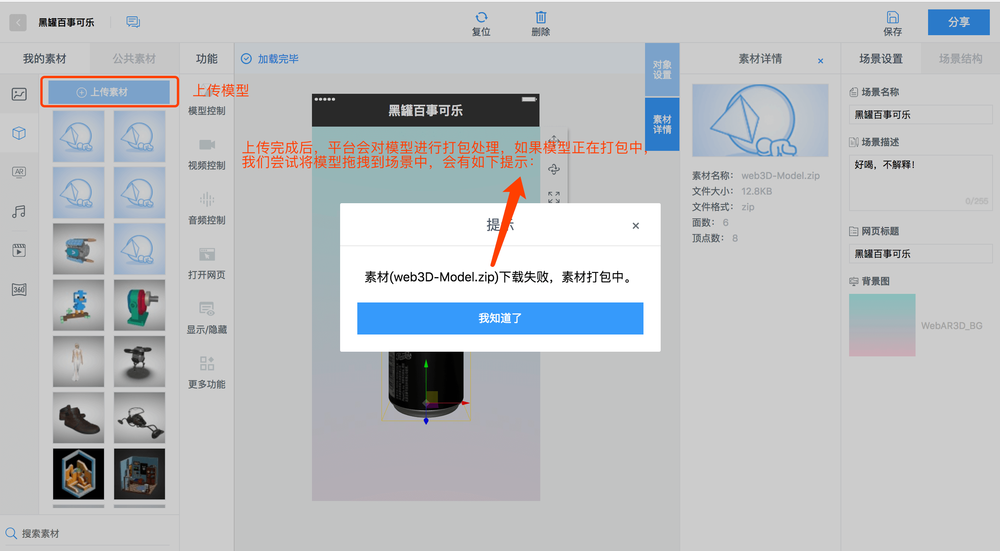
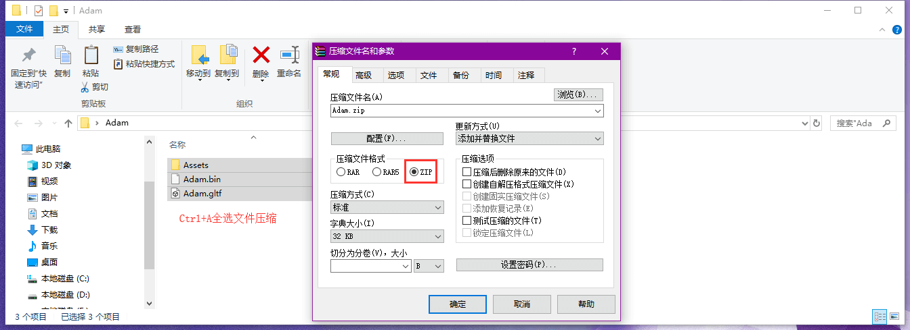
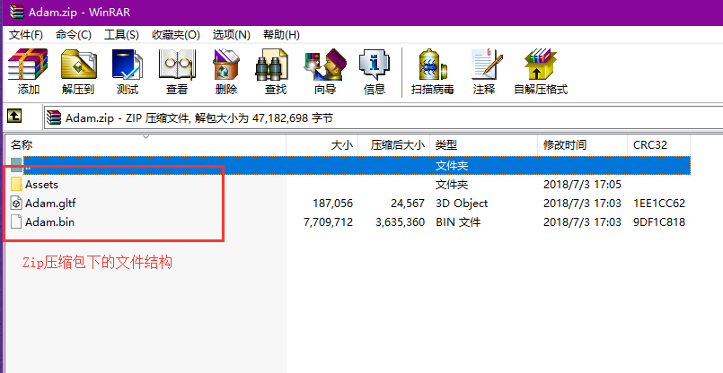
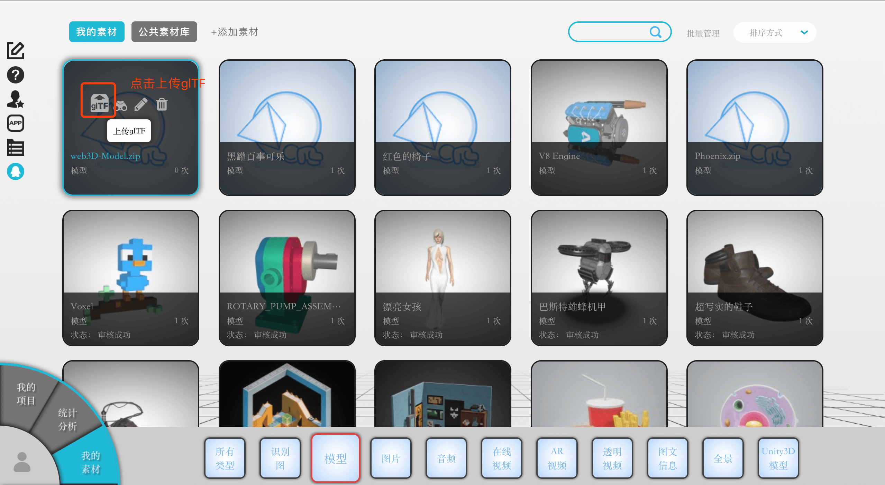
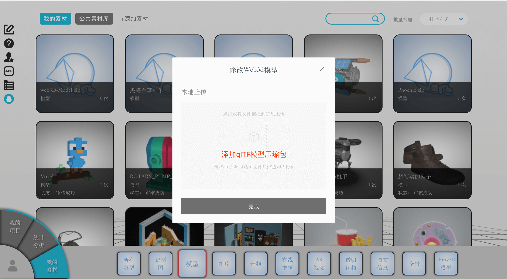

# 模型的修改-glTF上传
### glTF上传
当前平台支持PBR渲染，但是暂时上传的模型（FBX、OBJ）不支持PBR渲染工作流所需要的全部贴图，值得高兴的是平台支持通过一种特殊的方式来支持。

接下来就是具体的介绍如何实现这样的功能，如果你对RAVVAR平台不够熟悉，[点击此处](https://github.com/yangfawen/WebXR/blob/master/README.md)获得RAVVAR WebAR/VR/3D平台的入门教程。

### 1.上传普通的FBX或OBJ的模型压缩包到平台

注意：我们需要耐心等待模型打包完成，这一过程需要5-10分钟，直到模型打包完成后，才能进行下一步。（如果素材一直显示打包中，请加入QQ群联系我们：465132969）

### 2.进入素材页面

### 3.选择模型分类

### 4.找到刚才在场景编辑器下上传的模型文件，点击“上传glTF”

### 5.添加glTF模型包

经过以上的部分，我们再回到编辑器中，就会呈现完整的PBR渲染效果了。

此时可能会有这样的疑问，这个glTF究竟是什么文件？我改如何制作？点击此处获取相关教程。

还可以参考：[教程1](https://www.khronos.org/blog/art-pipeline-for-gltf) [教程2](https://developers.facebook.com/docs/sharing/3d-posts/glb-tutorials) 
[下载PDF](https://github.com/yangfawen/glTF-Export-Tutorial/blob/master/glTF-Upload-Plugins/GLB-Tutorial.pdf)
导出的glTF文件如下：包含一个gltf文件、一个bin文件、以及一个文件夹（文件夹可能会有多层，贴图位于里面的文件夹中）
